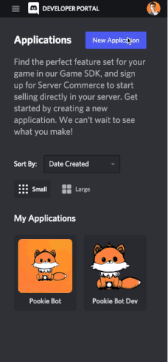
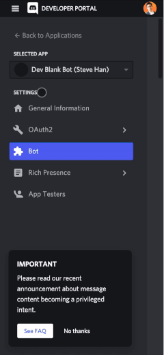

# Install

- Clone this repository
- npm install

# Running locally
make sure you have node > v16.13.1 installed locally, if not, checkout [nvm](https://github.com/nvm-sh/nvm)

```
nvm install v16.13.1
nvm use
npm install
cp config.test.js config.js
```

To develop the bot locally, you can create your own dev blank server with your own dev blank bot

## Create Dev Server
Create your dev server instantly from [this server template](https://discord.new/xxbhaey7szrC)

## Create Dev Bot
You can create your own blank dev bot in 3 steps and 30 seconds
- [Create a New Application on discord developer portal](https://discord.com/developers/applications) with a name
- Create a bot for the application
- Copy bot token and oAuth clientId into config.js




## Enable Privileged Intent
For the bot to access members on a server, discord requires a "Privileged Intent" GUILD_MEMBERSHIP
You need enable it in the bot settings



## Add Dev Bot to Dev Server
Run this script and open the generated link in browser to add your bot
```
node addDevBot.js
```

## Generate Config File
Now that your dev bot is connected with your dev server, you can generate part of the config.js with this
```
node generateConfig.js
```

# Running tests

npm run test
